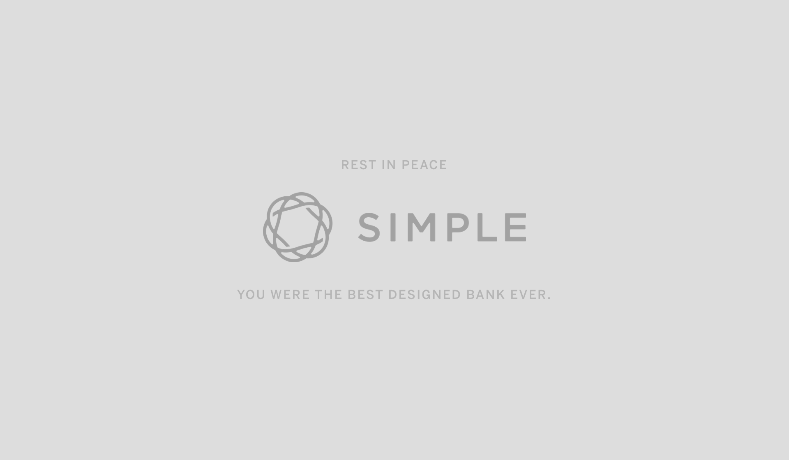
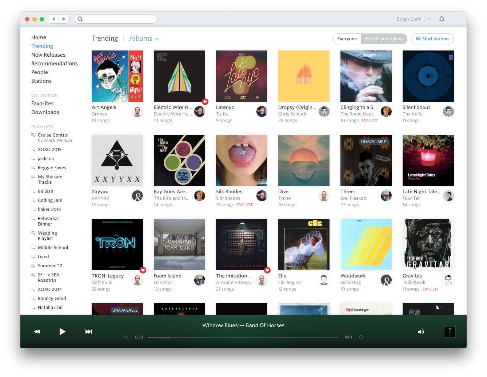

I got news today that my bank, Simple, would be shutting down their service. Simple Bank is the design-forward, startup bank inside of BBVA Compass, a large international financial services company headquartered in Bilbao, Spain. It looks like Simple users will eventually be rolled into BBVA's system, although Simple's apps and website will work for the time being. Simple's design is gorgeous. It's user experience is wonderful. Their mobile app is one the best in banking and their web app even supports features like dark mode. These features matter to me because I'm a designer. They endlessly please me. They make me a happy and loyal customer because it shows that they care to spend time working on features that modern mobile and desktop users want to use. 

Whenever I saw Simple would be shuttered, it reminded me of the fate of one of the early streaming music services, Rdio. Like Simple, Rdio was a design forward, user experience dynamo whose users delighted in its design and features. It was a beautiful music player whose design was far ahead of its time. You could tell that they hired [great designers](https://www.designerfund.com/blog/day-in-the-life-rdio-ryan-sims/) and they crafted the app with care. Even now, 5 years later, it's design looks fresh and not the least bit dated. Sadly, the company was never able to find the right business model or user base to compete with Spotify.

Rdio had a lasting effect on people. I still see people comparing Spotify and Apple Music to Rdio's feature set. At least once a year I'll see someone tweet: "[I miss Rdio](https://twitter.com/brad_frost/status/724712985181167621?s=20)." A few likes will straggle in and maybe some comments about features they miss. Rdio was [eventually dwarfed by Spotify, filed for bankruptcy, and bought by Pandora](https://www.theverge.com/2015/11/17/9750890/rdio-shutdown-pandora). Rdio is long gone. Its domain redirects to Radio.com, likely because it's a common misspelling. 

What Rdio and Simple make me wonder is, how much does a great design matter to business outcomes? As a person who really cares about great design, I happily pay extra for a great user experience. I know that makes me a rarity. Does a great design keep users loyal longer? I think it does, but it won't cover a multitude of business sins. It's much more likely that business reasons better explain why both companies are gone. It doesn't matter how pretty your pixels are or how easy your onboarding process is, if you don't have great a business behind those pixels. The opposite is also true. Whenever I see a bad design, it's much more difficult, no matter how good the business is to gain and keep me as a user. Whenever I see a product with a great design, I tend to assume there's a great business behind the design. Sadly though, I've been around long enough to see many of the best designed apps flounder and eventually die like Rdio and Simple.

I'm not sure what I'll end up doing with my money in Simple. I joined with the idea that I'd be joining a smaller bank, so maybe I'll find a smaller, local bank. That bank will likely have a much worse user experience. I'll likely be annoyed in a few years and I'll find myself tweeting: "I miss Simple."

---

If you want to read more lovely eulogies about Rdio, here are a few great ones:
- [Ode to rdio (2020)](https://edvinasbartkus.com/rdio/)
- [A Eulogy for Rdio (2015)](https://www.theatlantic.com/technology/archive/2015/11/a-eulogy-for-rdio/416310/)
- [Rdio, You’ll Be Missed. (2015)](https://medium.com/@bryanjclark/rdio-you-ll-be-missed-4322d2e7fbc4)