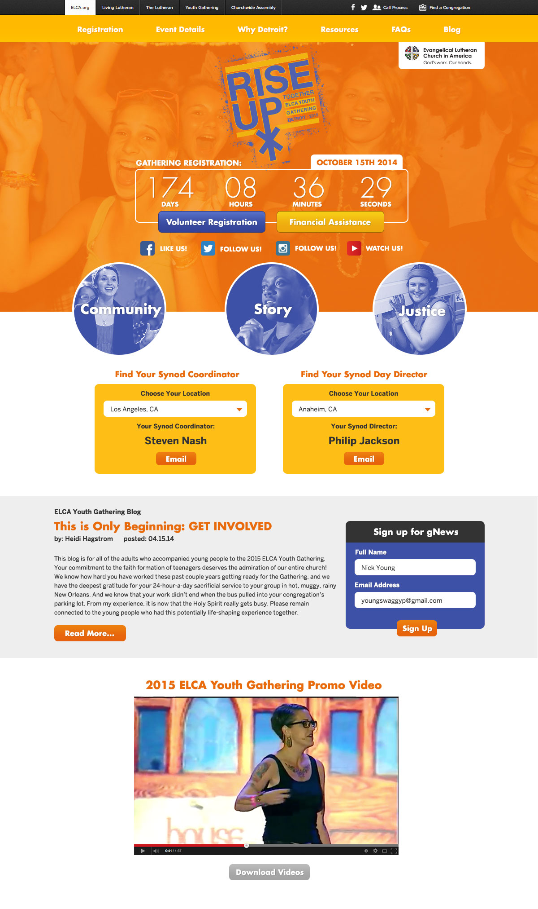

The ELCA (Evangelical Lutheran Church of America) is the largest Lutheran denomination in the world, and has its offices in Chicago. I have been able to work with them on a freelance basis many times basis and I always love my time getting to work with the ELCA. They are always kind, eager to learn, and really appreciate my skills and what I have to offer.

This project was for the triennial 'Youth Gathering' which brings together nearly 40,000 Lutheran youth from all over the country for a week of teaching, music and service. The Youth Gathering is a really big deal in the life of the denomination and the site is a really important part of disseminating information to an incredible amount of people. Students, parents, youth leaders, church members, etc all had a stake at some point in what was happening on the site, and it was important to quickly and easily provide that information without barriers.

[Live Site](https://www.elca.org/YouthGathering)

