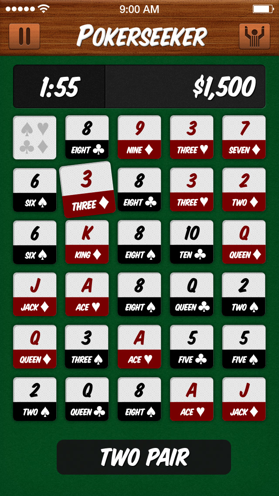

Pokerseeker is one of those side projects that will happen—one day. The brainchild of Frank Korf, it's a mashup of the classic poker game with the word game Boggle. You make as many poker hands as you can in an allotted time, and compete to get the highest score. Anyone with a background in design will know that it's designed in a skeuomorphic style of design, to emulate an actual poker table. This has gone out of style in many places around the internet and app stores alike, but I still like this kind of design for some projects. In many ways, it's beautiful and a really fun way to create. It might not be necessary (as many in the design world have argued), but it does feel very approachable and fun in a way that a gradient or flat color don't always convey.

There's no date on when this will happen, just hopefully, someday.

