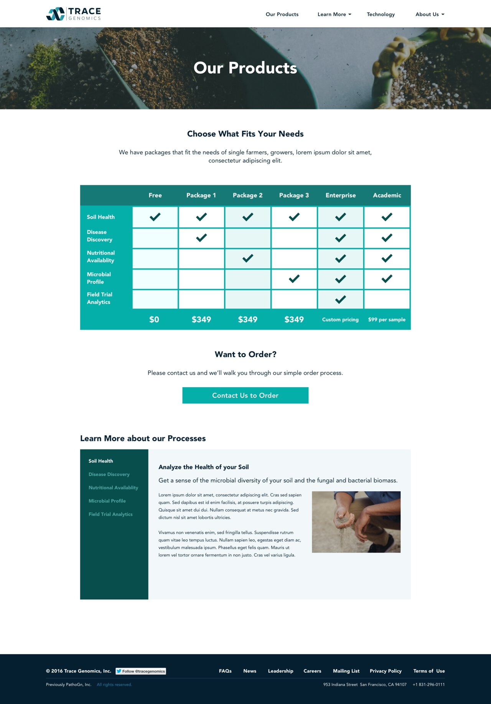

Trace Genomics is doing for crops what 23andme is doing for human genetics. They give insights into farmer's and agronomist's crops and help them to make intelligent, data driven decisions about what to grow. I've worked with them to create marketing materials for their site and helped design an internal web app for their customers to track samples and soil health over time.

<a class="btn btn-outline-dark mb-32" target="_blank" href="https://tracegenomics.com">Live Site</a>

