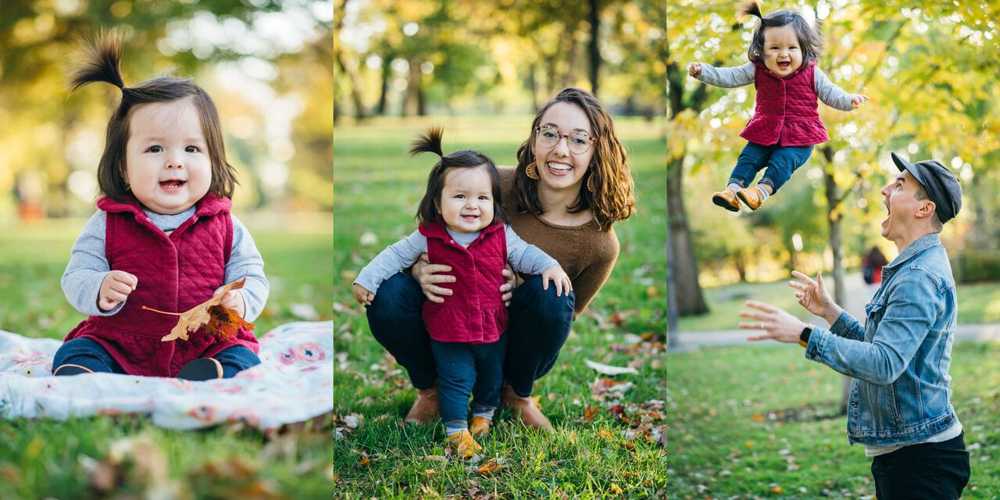

This shortcut takes multiple images, resizes them so they are the same size, and then combines them either horizontally, vertically or in a grid. Very simple, but very powerful. I use this all of the time for posting images to social media or comparing photos side by side.

<a class="btn btn-outline-dark" href="https://www.icloud.com/shortcuts/0d3f8993973642fea9bc9a8ebb72ff30" target="_blank" rel="nofollow noopener noreferrer">Download Shortcut</a>
